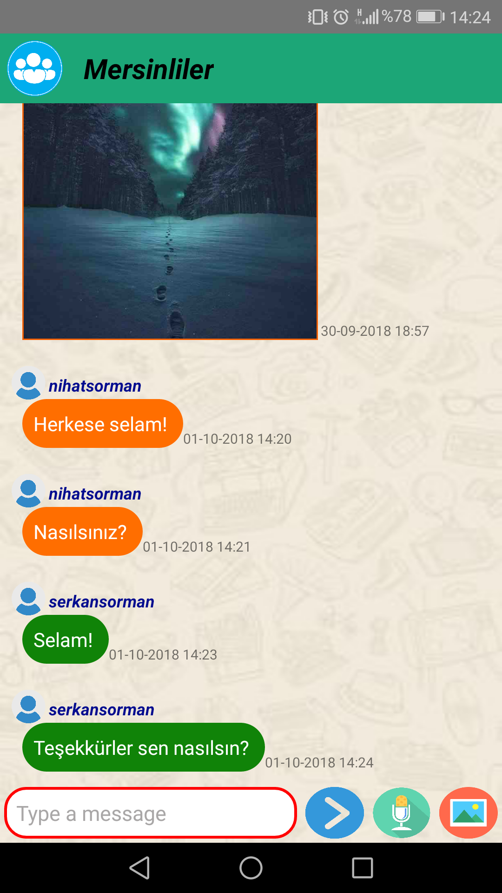
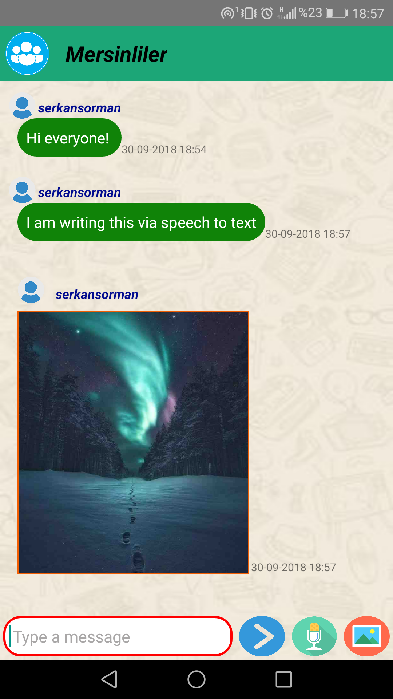

Android Messaging app where people joining rooms via Gmail account according to their interests. In all room, people can chatting, sharing images. Messages are encrypted using the AES algorithm and stored in the Firabase.

  

You can send message via speech to text and receive instant notification. Also you can send pictures by taking photos from your camera or uploading them from the gallery.

  
